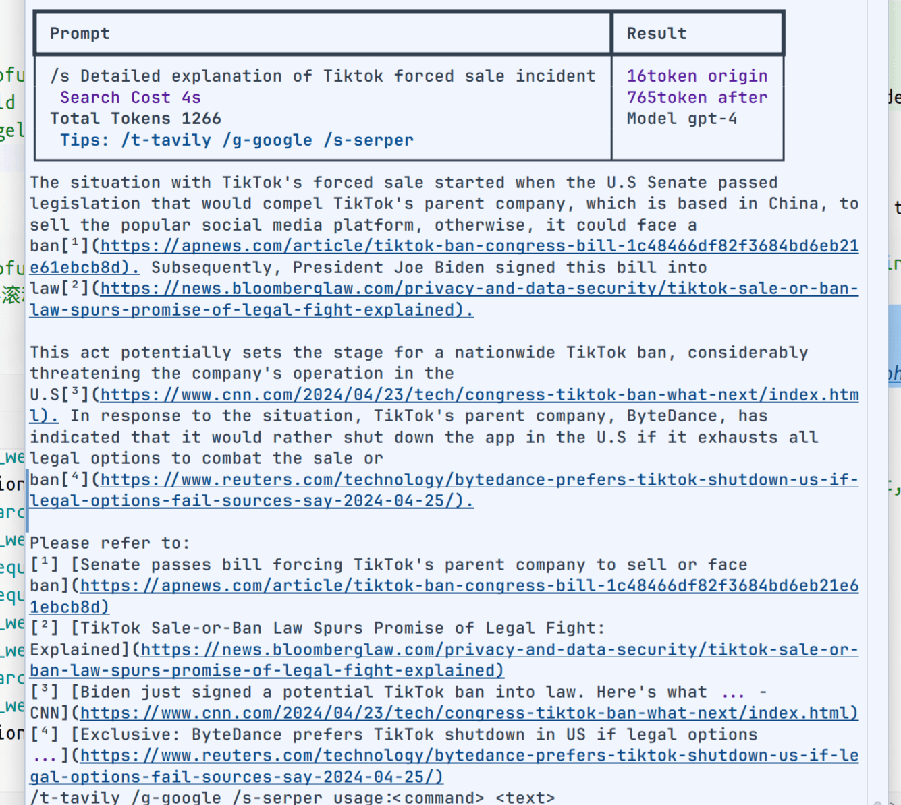
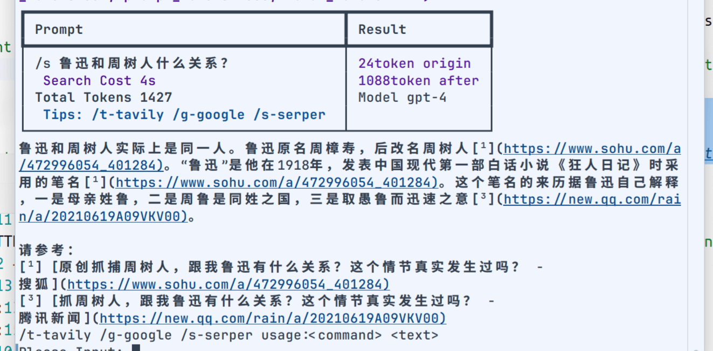
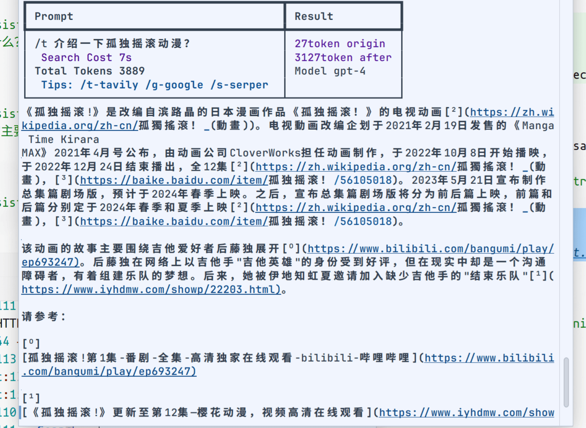
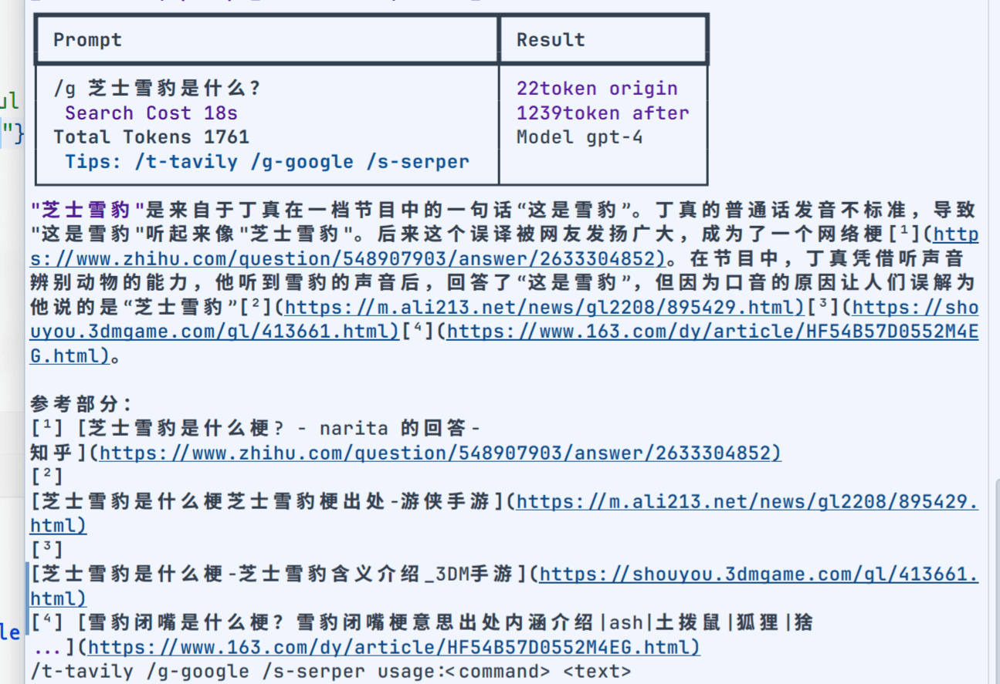

# perplex-server

此项目是为了模拟 perplex 的搜索结果。

实施在 [OhMyGpt](https://www.ohmygpt.com/) 联网检索。

### Demo

效果如下：

| Demo1                      | Demo2                      | Demo3                      | Demo4                      |
|----------------------------|----------------------------|----------------------------|----------------------------|
|  |  |  |  |

> 基于 OpenAI 的 GPT-4 模型。

### Run Server

**.env**

````dotenv
OPENAI_BASE_URL=https://api.openai.com/v1/chat/completions
OPENAI_API_KEY=YOUR_API_KEY
OPENAI_MODEL=gpt-4
TAVILY_API_KEY=tvly-
GOOGLE_API_KEY=xxx
GOOGLE_CSE_ID=xxx
SERPER_API_KEY=xxx
````

- https://tavily.com/
- https://serper.dev/
- https://developers.google.com/custom-search/v1/overview

```shell
pip install pdm
pdm install
pdm run python3 main.py
```

### Run Client

```shell
pdm run python3 client.py
```

## 🧀 Sponsor

[](https://www.ohmygpt.com)
